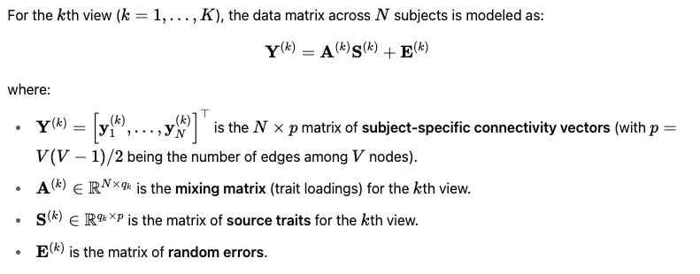
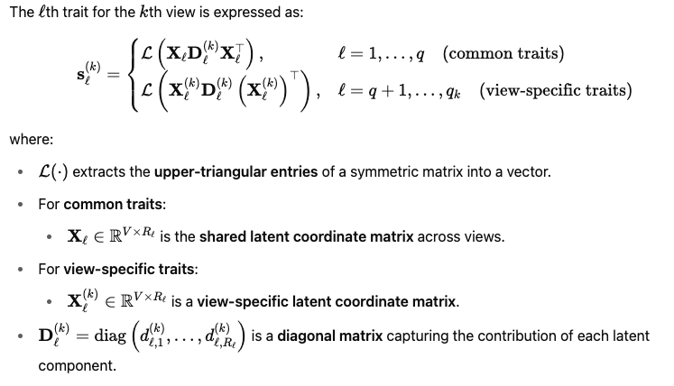
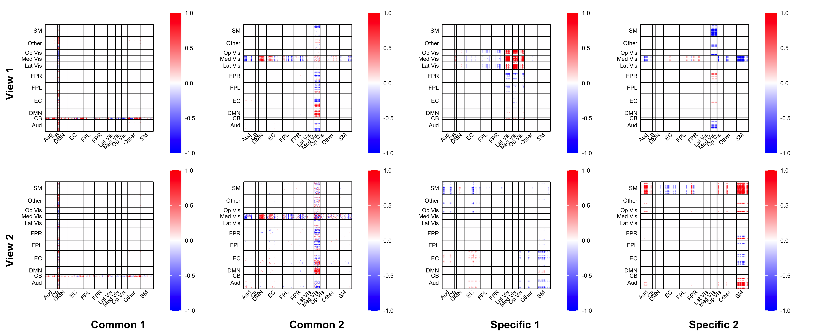

# MultiView.LOCUS A Low-Rank, Sparse Blind Source Separation for Multi-View Brain Connectome.

`MultiView.LOCUS` is an R package implementing a Low-Rank, Sparse Blind Source Separation framework designed for analyzing Multi-View brain connectivity data. The approach decompose the Multi-View brain connectivity data in to both shared and unique connectivity trait sources across views, addressing challenges inherent in brain connectome analyses such as high dimensionality and noise, providing interpretable and powerful insights into neurodevelopmental and neuropsychiatric studies.


-   I. Installation
-   II. Method
-   III. Detailed Descriptions of the Functions
-   IV. A Toy Example

## I. Package Installation
You can easily install `MultiView.LOCUS` from GitHub with:

```r
if (!requireNamespace("devtools", quietly = TRUE))
  install.packages("devtools")
devtools::install_github("Emory-CBIS/MultiView.LOCUS")
library(MultiView.LOCUS)
```
Please also make sure you have dependence "quadprog,
    far,
    stats,
    utils,
    dplyr,
    MASS,
    ica,ggplot2,lattice,gridExtra,reshape2,tibble" 

## II. Method

###  MultiView.LOCUS Method
MultiView.LOCUS (** Multi-View Low-rank Decomposition of Brain Connectivity Matrices with Universal Sparsity by Canonical Correlation Analysis**) is a specialized form of Blind Source Separation designed explicitly for Multi-View brain connectivity data. The method uses a low-rank decomposition combined with sparsity-inducing penalties, enabling it to identify robust, interpretable connectivity patterns to each view.

Formally, Locus-CCA identifies $q_k$ latent source **$S^{(k)}$** of each view $k$:

#### Method formulation




#### Schematic plot


#### Method Highlights

- **Low-rank factorization**:  
  Locus-CCA employs low-rank decomposition to capture intrinsic, structured patterns within connectivity matrices. This efficiently reduces model complexity and enhances interpretability.

- **Universal Sparsity Regularization**:  
  Sparsity regularization (L1, Hardthreshold or SCAD penalties) is applied element-wise to canonical weights, ensuring robust and interpretable connectivity patterns that represent meaningful neural circuitry associated with clinical or behavioral phenotypes.

- **Common versus view-specific sources**:  
  The common and view-specific sources are considered simutaneously in our model.


### Functions Overview
The structure of the package is as follows, and detailed descriptions of the function arguments are provided in the section below:

-   **Main Function:**
    -   `multi_view_decomposition`: performs Multi-View LOCUS on Multi-View brain connectivity.
-   **Tuning Parameter Selection:**
    -   `calculate_bic`: selects the tuning parameters $\phi$ and $\psi$.
-   **Helper Functions:**
    -   `Ltrinv` and `Ltrans`: transform the brain connectivity to vectorized upper triangle and transform it back.
    -  `plot_conn`:  plots the canonical weights on brain connectivity in the form of heatmap for adjancency connectivity matrix.
-   **Function called**
    -  `Locus_preprocess`:  Preprocessing of connectivity data.
    -  `joint_update_approx`: The  function of fitting Multi-View LOCUS.
    -  `joint_initial`: Initialization for parameters in our model. 
## III. Detailed Descriptions of the Functions

### 1. Multi-View LOCUS function

```         
multi_view_decomposition(Y, q, q_common, V, MaxIteration=5000, penalty="SCAD", phi = 0.9, psi = 1, gamma =3,
                  espli1=5e-4, espli2=5e-4, rho=0.95, silent=FALSE)
```

Arguments
- Y: A list of length K (number of views), where each element is an 𝑛×𝑝 matrix of group-level brain connectivity data for a view.
Each row corresponds to a subject, and each column corresponds to an edge in the connectivity network.
To construct each matrix in Y from subject-level adjacency matrices (size V×V), use the Ltrans() function to vectorize the upper-triangular elements (excluding the diagonal).

- q: A vector of integers of length K. Specifies the number of view-specific connectivity traits to extract for each view.

- q_common: An integer.Specifies the number of shared connectivity traits across all views.

- V: An integer. The number of nodes in the brain network.The number of edges 𝑝 should satisfy $V(V-1)/2$


- MaxIteration: An integer (default = 5000).  The maximum number of iterations for the decomposition algorithm.

- penalty: A string specifying the sparsity regularization method for the source traits. Options include:

    -"NULL": No sparsity enforced.

    -"Hardthreshold": Hard-thresholding penalty.

    -"L1": Lasso penalty (elementwise l1-norm).

    -"SCAD": Smoothly Clipped Absolute Deviation penalty (default), introduced by Fan and Li (2001).

- phi: A numeric value (default = 0.9).
Regularization parameter controlling the strength of the sparsity penalty.

- psi: A numeric value (default = 1).
A coupling parameter enforcing synergy of shared components across different views.

- gamma: A numeric value (default = 3).
Used only when penalty = "SCAD".
Controls the concavity of the SCAD penalty. Must be greater than 2.

- espli1: A numeric value (default = 5e-4).
Tolerance for convergence based on the change in the mixing matrices.

- espli2: A numeric value (default = 5e-4).
Tolerance for convergence based on the change in the source traits.

- rho: A numeric value between 0 and 1 (default = 0.95).  A threshold parameter for determining the low-rank structure of the source traits. A higher rho encourages capturing more variance (leading to a higher rank).

- silent: Logical (TRUE or FALSE, default = FALSE). If FALSE, progress messages are printed during model fitting.


### 2. BIC_cal function

```
calculate_bic(Y, model)
```

- Y: 	A list of original input matrices for each view. Each element should be an 𝑁×𝑝 matrix, where N is the number of subjects and p is the number of connectivity edges (vectorized upper triangle).

-model: The result list returned by multi_view_decomposition(), containing fitted mixing matrices (A) and source matrices (S) for each view.

`BIC_cal` function serves as a valuable guide for tuning the parameters $\phi$ and $\psi$.  The function outputs a single BIC value.  A model with lower BIC value is prefered. However, it is worth noting that in certain datasets, the choice may not be straightforward solely based on BIC. Tuning parameters can also be selected based on visual inspection of the extracted connectivity traits to achieve the desired level of sparsity and appealing neuroscience interpretation.


## IV. A Simulation Example

In this section, we provide an example in our Simulation scenario III to demonstrate the implementation of the package. We generated toy example data **Y** based on  estimated lantent connectivity traits from real brain connectivity. 
Specifically, we generated connectivity matrices based on the real connectivity traits, using [Power's brain atlas](https://www.ncbi.nlm.nih.gov/pmc/articles/PMC3222858/). Each connectivity  trait is symmetric with dimensions of $V \times V$, where $V = 264$ is the number of nodes.   The input $Y$ matrix would be of dimension $n \times p$, where $n = 100$ subjects and $p = V(V-1)/2$ edges. Suppose we have $n$ connectivity matrices from each of the $n$ subjects, where each matrix is a $V \times V$ symmetric matrix. To generate our input matrix $Y$, we use the `Ltrans()` function to extract the upper triangular elements of each  matrix and convert them into a row vector of length $p = \frac{(V-1)V}{2}$. We then concatenate these vectors across subjects to obtain the group connectivity data **Y**. 

### Data loading
``` r
# library 
library(MultiView.LOCUS)

# Load data in our example_data folder
Data_x = readRDS('example_data/Data_x.rds')
Data_y = readRDS('example_data/Data_y.rds')

# check the dimension
dim(Data_x)
dim(Data_y)
```

### Parameter Selection.

#### Component numbers
We propose to select the number of  components  $q$ and $q_k$ based on the connICA + dual regression
```r
# Step 1: Select Common Components
select_common_components <- function(Y_list, q_candidates, similarity_measure = "correlation") {
  # Inputs:
  # - Y_list: list of (n x p) matrices (one per view)
  # - q_candidates: vector of candidate q values (e.g., 5:20)
  # Output:
  # - Similarity score per q
  
  Y_agg <- do.call(rbind, lapply(Y_list, t))
  similarity_scores <- numeric(length(q_candidates))
  
  for (i in seq_along(q_candidates)) {
    q <- q_candidates[i]
    conn_joint <- icaimax(Y_agg, center = TRUE, nc = q)
    S_agg <- conn_joint$S
    
    similarities <- c()
    for (k in seq_along(Y_list)) {
      A_k <- t(Y_list[[k]]) %*% S_agg %*% solve(t(S_agg) %*% S_agg)
      S_k <- solve(t(A_k) %*% A_k) %*% t(A_k) %*% t(Y_list[[k]])
      similarities <- c(similarities, mean(diag(abs(cor(t(S_k))))))
    }
    similarity_scores[i] <- mean(similarities)
  }
  
  return(data.frame(q = q_candidates, similarity = similarity_scores))
}
# Step 2: Select View-Specific Components
select_view_specific_components <- function(Y_list, S_agg, view_indices, threshold = 0.05) {
  # Inputs:
  # - Y_list: list of (n x p) matrices
  # - S_agg: common components matrix
  # - view_indices: vector 1...K for the views
  # Output:
  # - Number of view-specific components per view
  
  view_specific_counts <- numeric(length(Y_list))
  
  for (k in view_indices) {
    A_k <- t(Y_list[[k]]) %*% S_agg %*% solve(t(S_agg) %*% S_agg)
    residual_k <- t(Y_list[[k]]) - S_agg %*% t(A_k)
    
    ic_anchor <- icaimax(residual_k, center = TRUE, nc = 15) # try 15 residual components
    prominence <- apply(abs(ic_anchor$M), 2, mean)
    
    view_specific_counts[k] <- sum(prominence > threshold)
    view_specific_counts[k] <- max(1, view_specific_counts[k]) # force at least 1
  }
  
  return(view_specific_counts)
}
```

#### regularization parameters
Next, we proceed to use the BIC-type criterion to select the hyperparameters `phi` and `psi`. In this toy example, we  explore various value combinations to observe their impact on the BIC value. We recommend initially considering the range $seq(0, 1, 0.1)$ to evaluate the BIC.

``` r
# BIC-based selection of phi and psi

# Define candidate grids
phi_seq <- seq(0.5, 3, by = 0.5)  # for example, sparsity strength
psi_seq <- seq(0.1, 2, by = 0.2)  # coupling strength across views

# Initialize storage
BIC_matrix <- matrix(NA, nrow = length(phi_seq), ncol = length(psi_seq),
                     dimnames = list(paste0("phi=", phi_seq), paste0("psi=", psi_seq)))

# Loop over all (phi, psi) combinations
for (i in seq_along(phi_seq)) {
  for (j in seq_along(psi_seq)) {
    cat("Running phi =", phi_seq[i], "and psi =", psi_seq[j], "\n")
    
    # Fit model with current (phi, psi)
    result_bic <- multi_view_decomposition(
      Y = list(Data_x, Data_y),
      q_common = 2,
      q = c(2, 2),
      V = 264,
      penalty = "SCAD",
      phi = phi_seq[i],
      psi = psi_seq[j],
      gamma = 2.1,
      rho = 0.95,
      espli1 = 1e-3,
      espli2 = 1e-3,
      MaxIteration = 500
    )
    
    # Calculate BIC
    bic_values <- calculate_bic(Y = list(Data_x, Data_y), res = result_bic)
    BIC_matrix[i, j] <- sum(bic_values)  # or mean(bic_values), depending on your preference
  }
}

# Find optimal (phi, psi) combination
optimal_indices <- which(BIC_matrix == min(BIC_matrix, na.rm = TRUE), arr.ind = TRUE)
optimal_phi <- phi_seq[optimal_indices[1]]
optimal_psi <- psi_seq[optimal_indices[2]]

cat("Selected phi =", optimal_phi, "and psi =", optimal_psi, "\n")
```

It is important to note that the procedures for selecting the number of components and tuning regularization parameters provide useful guidance but should not be regarded as definitive. Although criteria such as connICA + dual regression and BIC offer valuable insights, the choices may not always be straightforward or fully reliable based solely on these automated metrics. In practice, we recommend that users also consider empirical validation, reproducibility, and neuroscience interpretability when finalizing the number of components and tuning parameters. Supplementary strategies, such as inspecting sparsity levels or evaluating biological relevance of extracted traits, are encouraged to complement the data-driven selection.

### Application to the data

Next, we perform the Multi-View LOCUS using the parameters we just selected (example).

``` r
res <- multi_view_decomposition(
    Y = list(Data_x, Data_y),
    q_common = 2,
    q = c(2, 2),
    V = 264,
    penalty = "SCAD",
    phi = 2,
    psi = 0.5,
    gamma = 2.1,
    rho = 0.95,
    espli1 = 1e-2,
    espli2 = 1e-2,
    MaxIteration = 500
  )
```
We visualize the connectivity traits on brain connectivity  based on the Power's atlas. Please note that the visualization code is prepared based on the Power's atlas, and please modify as needed if other atlases are used. 

```r
library(gridExtra)
library(grid)

# === Same plotting setup as before ===
plot_conn_wrapper <- function(vec, V) {
  mat <- Ltrinv(vec, V, d = FALSE)
  plot_conn(mat)
}

V <- 264
n_common <- 2
n_spe <- 2
plot_list <- list()

for (i in 1:(n_common + n_spe)) {
  plot_list[[i]] <- plot_conn_wrapper(res$S_sparse[[1]][i, ], V)
}
for (i in 1:(n_common + n_spe)) {
  plot_list[[i + 4]] <- plot_conn_wrapper(res$S_sparse[[2]][i, ], V)
}

# === Labels ===
col_titles <- c("Common 1", "Common 2", "Specific 1", "Specific 2")
col_grobs <- lapply(col_titles, function(title) {
  textGrob(title, gp = gpar(fontsize = 12, fontface = "bold"))
})

row_titles <- c("View 1", "View 2")
row_grobs <- lapply(row_titles, function(title) {
  textGrob(title, rot = 90, gp = gpar(fontsize = 12, fontface = "bold"))
})

# === Main plot ===
plot_grid <- arrangeGrob(grobs = plot_list, nrow = 2, ncol = 4)

# === Assemble with expanded margins ===
full_plot <- arrangeGrob(
  plot_grid,
  left = arrangeGrob(grobs = row_grobs, ncol = 1),
  bottom = arrangeGrob(grobs = col_grobs, nrow = 1),
  padding = unit(2, "lines")  # Increase padding here
)
```

Example outputed components, the first second rows represent the view 1 and view 2 resepctively. As in our component number specification, the first two columns represent the common sources, and rest columns represent the view-specific sources. 



